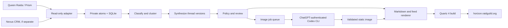
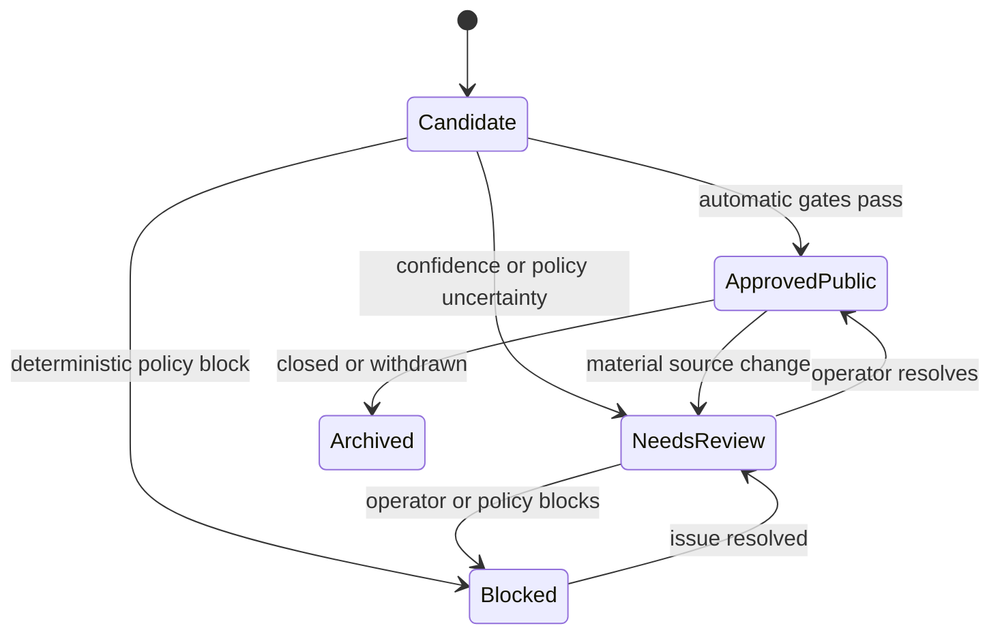

# Horizon Technical Specification

Status: Build candidate

Companion: [PRD.md](PRD.md)

## 1. Purpose

This specification defines a build-ready Horizon MVP: a Quartz 4 site with a
custom chronological feed, generated from private Queen Raida/Prism data by a
scheduled local agent.

The design intentionally follows the
[ClawRyderz template](https://github.com/sedim3nt/telegram-knowledge-graph)
where it is proven:

- Immutable private source atoms.
- Regenerable classification and synthesis.
- Markdown as the publishing projection.
- Quartz as the static site layer.
- A scheduled local worker that commits and deploys approved changes.

Horizon adds conservative opportunity clustering, BD states, automatic
public-safety gates, a newest-activity-first feed, and automated ChatGPT
illustrations.

## 2. Fixed Implementation Choices

| Area | Decision |
| --- | --- |
| Runtime | Python 3.12 worker; Node.js LTS for Quartz |
| Site | Quartz 4 with custom components |
| Private state | SQLite plus immutable JSON atoms, all gitignored |
| Published state | Generated Markdown, JSON indexes, and static images |
| Source | Read-only Queen Raida/Prism adapter |
| Review | Exception queue for withheld items and human corrections |
| Image execution | Local `codex exec` using saved ChatGPT/Codex authentication |
| Image tool | Built-in `$imagegen` with RaidGuild reference images |
| Image API | Forbidden; no `OPENAI_API_KEY` or `CODEX_API_KEY` |
| Refresh | Every six hours and on demand |
| Deployment | `main` to Cloudflare Pages at `horizon.raidguild.org` |

This stack is sized for a $5,000 funded MVP. A hosted application server,
PostgreSQL, and a full admin dashboard are not justified until usage requires
them.

## 3. System Context



Raw source bodies and prompts containing them stop before the rendering
boundary. The image generator receives only a sanitized visual brief.

## 4. Repository Layout

```text
agent/
  pyproject.toml
  src/horizon/
    config.py
    models.py
    ingest.py
    classify.py
    cluster.py
    synthesize.py
    policy.py
    review.py
    images.py
    render.py
    publish.py
    orchestrator.py
    adapters/
      base.py
      queen_raida.py
      fixtures.py
  data/                         # gitignored
    atomic/
    classify/
    state.sqlite3
    runs/
  prompts/
    classify/
    compare/
    synthesize/
    sanitize/
    illustrate/
  scripts/
    seed_fixtures.py
    evaluate.py
    verify_image_runner.py
    orchestrate.py
fixtures/
  queen-raida/                  # synthetic only
  evaluations/
vault/
  index.md
  threads/
    <thread-slug>.md
  _meta/
    feed.json
    graph.json
  assets/
    threads/
      <thread-id>/
        banner-<version>.webp
        update-<update-id>.webp
    brand-fallbacks/
site/
  quartz.config.ts
  quartz.layout.ts
  quartz/
    components/
      HorizonFeed.tsx
      HorizonFilters.tsx
      ThreadCard.tsx
      ThreadTimeline.tsx
      ThreadStatus.tsx
      SyncStatus.tsx
    styles/
      horizon.scss
scripts/
  check-public-artifact.sh
  build-member.sh
  build-public.sh
meetings/
```

`agent/data/`, production prompts, credentials, and raw model responses are
never committed. The repository may contain synthetic fixtures only.

## 5. Component Map

| Component | Responsibility | Output |
| --- | --- | --- |
| Source adapter | Page through changed Queen Raida/Prism records | Normalized atoms |
| Ingest | Validate, hash, deduplicate, and persist | Atomic JSON and cursor state |
| Classifier | Extract BD relevance, entities, stage, action, and sensitivity | Classification JSON |
| Candidate generator | Find plausible memberships using bounded keys | Candidate pairs |
| Cluster engine | Apply hard keys, vetoes, scores, and overrides | Thread memberships |
| Synthesizer | Produce immutable current state and meaningful updates | Thread versions |
| Policy engine | Allow, redact, block, or request review | Projection candidates |
| Review service | Persist human decisions and overrides | Approved versions |
| Image queue | Create deterministic jobs for material versions | Image job records |
| Image runner | Invoke ChatGPT image generation through Codex CLI | Candidate image |
| Asset validator | Verify and optimize generated files | Approved WebP |
| Renderer | Generate thread Markdown and feed index | `vault/` projection |
| Quartz site | Render feed, search, filters, and thread pages | Static build |
| Publisher | Commit, push, deploy, and record run state | Live snapshot |

## 6. Source Adapter Contract

Horizon must not depend directly on Queen Raida or CRM table names.

```python
from dataclasses import dataclass
from datetime import datetime
from typing import Literal, Protocol

SourceType = Literal[
    "discord_message",
    "discord_thread",
    "meeting_transcript",
    "meeting_summary",
    "crm_note",
    "crm_opportunity",
    "proposal",
    "other",
]

@dataclass(frozen=True)
class SourceRecord:
    source: str
    source_type: SourceType
    source_id: str
    source_revision: str | None
    occurred_at: datetime
    updated_at: datetime
    deleted_at: datetime | None
    body: str
    author: dict | None
    container: dict | None
    internal_url: str | None
    visibility_hint: str | None
    relations: dict
    metadata: dict

@dataclass(frozen=True)
class SourcePage:
    records: list[SourceRecord]
    next_cursor: str | None
    has_more: bool
    watermark: datetime

class SourceAdapter(Protocol):
    def capabilities(self) -> dict: ...
    def list_records(
        self, *, cursor: str | None, updated_after: datetime | None, limit: int
    ) -> SourcePage: ...
    def healthcheck(self) -> dict: ...
```

Adapter requirements:

- Read-only credentials with minimum scope.
- Stable source IDs.
- Incremental cursor or updated-time watermark.
- Idempotent page replay.
- Edit and deletion behavior documented.
- Bounded retries with backoff.
- No source body in logs or exception strings.
- Contract tests against sanitized fixtures.

If deletion events are unavailable, the worker performs a bounded reconciliation
over the active source window.

## 7. Canonical Schemas

All persisted objects include `$schema`, UTC timestamps, prompt/model versions
when AI is involved, and a content hash.

### 7.1 Atomic Record

Path: `agent/data/atomic/<source>-<source-id>.json`

```json
{
  "$schema": "horizon.atom.v1",
  "id": "queen_raida:discord_message:123",
  "source": "queen_raida",
  "source_type": "discord_message",
  "source_id": "123",
  "source_revision": "4",
  "occurred_at": "2026-07-23T17:10:00Z",
  "updated_at": "2026-07-23T17:12:00Z",
  "deleted_at": null,
  "author": {"id": "discord:1", "display_name": "Internal Name"},
  "container": {"kind": "discord_channel", "id": "456"},
  "body": "private source text",
  "internal_url": "https://discord.com/...",
  "visibility_hint": "internal",
  "relations": {
    "discord_thread_id": null,
    "meeting_id": null,
    "crm_opportunity_id": null,
    "proposal_id": null
  },
  "metadata": {},
  "content_hash": "sha256:..."
}
```

Atoms are immutable by revision. An edit writes a new revision; deletion writes
a tombstone. Only the latest valid revision participates in synthesis.

### 7.2 Thread

```json
{
  "$schema": "horizon.thread.v1",
  "id": "019...",
  "slug": "protocol-monitoring-support",
  "state": "approved_public",
  "created_at": "2026-07-01T12:00:00Z",
  "last_activity_at": "2026-07-23T17:10:00Z",
  "current_version_id": "019...",
  "membership_ids": ["019..."],
  "manual_overrides": ["019..."]
}
```

`last_activity_at` is derived from the latest accepted meaningful update. It is
not changed by render time, image generation time, or deployment time.

### 7.3 Thread Version

```json
{
  "$schema": "horizon.thread-version.v1",
  "id": "019...",
  "thread_id": "019...",
  "version": 4,
  "title": "Protocol monitoring support",
  "summary": "Approved current-state summary.",
  "why_it_matters": "Approved business context.",
  "stage": "scoping",
  "momentum": "active",
  "owner": {
    "display_name": "Approved owner",
    "contact_route": "https://discord.com/users/..."
  },
  "organizations": [],
  "service_lines": ["AI workflow design"],
  "needed_capabilities": ["DevOps"],
  "next_action": "Confirm scope owner.",
  "next_action_due_at": null,
  "open_questions": [],
  "last_activity_at": "2026-07-23T17:10:00Z",
  "meaningful_change_fields": ["stage", "next_action"],
  "confidence": {
    "clustering": 0.98,
    "synthesis": 0.91,
    "stage": 0.94
  },
  "evidence_claim_ids": ["019..."],
  "review_state": "approved_public",
  "visibility": "public",
  "prompt_version": "synthesize.v1",
  "model": "configured-codex-model",
  "created_at": "2026-07-23T17:20:00Z"
}
```

### 7.4 Thread Update

Thread updates are immutable timeline entries. A thread version may create zero
or one update.

```json
{
  "$schema": "horizon.thread-update.v1",
  "id": "019...",
  "thread_id": "019...",
  "thread_version_id": "019...",
  "occurred_at": "2026-07-23T17:10:00Z",
  "published_at": "2026-07-23T18:00:00Z",
  "headline": "Scope moved into active review",
  "summary": "Approved update summary.",
  "changed_fields": ["stage", "next_action"],
  "evidence_claim_ids": ["019..."],
  "image_asset_id": null,
  "review_state": "approved_public"
}
```

Updates are rendered ascending on the thread page. Feed cards use only the
current version and the latest accepted update timestamp.

### 7.5 Evidence Claim

```json
{
  "$schema": "horizon.evidence-claim.v1",
  "id": "019...",
  "thread_version_id": "019...",
  "claim_path": "next_action",
  "claim_text": "Confirm scope owner.",
  "atom_ids": ["queen_raida:meeting_summary:789"],
  "support": "direct",
  "confidence": 0.94,
  "member_label": "BD meeting summary, Jul 23",
  "authorized_source_url": "https://...",
  "public_label": null
}
```

Raw evidence text is never rendered.

### 7.6 Image Job And Asset

`kind` is `thread_banner` or `update_image`. Banners target `1440x550`; update
images target `1440x1440`. Update jobs also store `thread_update_id`.

```json
{
  "$schema": "horizon.image-job.v1",
  "id": "019...",
  "thread_id": "019...",
  "thread_version_id": "019...",
  "kind": "thread_banner",
  "state": "ready",
  "visual_brief_hash": "sha256:...",
  "prompt_version": "illustrate.v1",
  "reference_assets": [
    {
      "repo": "raid-guild/brand",
      "commit": "<pinned-commit>",
      "path": "public/assets/webp/moloch500/1440x550/ship-mech-c.webp"
    }
  ],
  "requested_at": "2026-07-23T17:30:00Z",
  "attempt_count": 1,
  "error_code": null,
  "asset_id": "019..."
}
```

```json
{
  "$schema": "horizon.image-asset.v1",
  "id": "019...",
  "thread_id": "019...",
  "thread_version_id": "019...",
  "path": "vault/assets/threads/019/banner-4.webp",
  "width": 1440,
  "height": 550,
  "mime_type": "image/webp",
  "sha256": "...",
  "alt_text": "Abstract line-art scene representing coordinated protocol work.",
  "review_state": "approved_public",
  "created_at": "2026-07-23T17:34:00Z"
}
```

### 7.7 Review Item

```json
{
  "$schema": "horizon.review-item.v1",
  "id": "019...",
  "kind": "cluster_merge",
  "state": "open",
  "priority": "normal",
  "thread_ids": ["019...", "019..."],
  "atom_ids": ["..."],
  "reason_codes": ["score_in_review_band"],
  "proposed_change": {},
  "assigned_to": null,
  "created_at": "2026-07-23T17:25:00Z",
  "resolved_at": null,
  "resolution": null
}
```

## 8. Review States

### 8.1 Content State



Allowed states:

- `candidate`
- `needs_review`
- `approved_public`
- `blocked`
- `archived`

`approved_public` is automatic only when clustering confidence is at least
`0.92`, synthesis confidence is at least `0.85`, every material claim has
evidence, and the sanitizer returns no unresolved finding.

### 8.2 Image State

```text
not_requested -> queued -> generating -> ready
                         \-> failed -> queued
ready -> rejected -> queued
ready -> superseded
```

Only `ready` assets with the required content approval may render. A failed,
rejected, or superseded image never removes the last approved image.

### 8.3 Durable Overrides

Supported overrides:

- `force_merge`
- `never_merge`
- `force_membership`
- `exclude_atom`
- `set_title`
- `set_stage`
- `set_owner`
- `set_visibility`
- `set_summary`
- `approve_public`
- `reject_image`
- `archive_thread`

Each override records author, reason, time, scope, and optional expiry. Automated
runs may not silently replace it.

## 9. Clustering

Clustering is the highest-risk subsystem.

### 9.1 Invariants

- Prefer under-clustering over over-merging.
- Never merge established threads solely on semantic similarity.
- Never allow a model to override a deterministic `never_merge`.
- Keep unresolved atoms separate.
- Preserve evidence for every membership decision.
- Recompute only affected candidates during incremental runs.

### 9.2 Decision Order

1. Apply human overrides.
2. Apply hard deterministic keys.
3. Apply hard vetoes.
4. Generate bounded candidate pairs.
5. Score remaining pairs.
6. Auto-merge only above the high threshold.
7. Queue the review band.
8. Keep lower-scoring records separate.

Recommended initial thresholds:

| Decision | Score |
| --- | --- |
| Auto-merge | `>= 0.92` |
| Operator review | `0.72-0.9199` |
| Keep separate | `< 0.72` |

Hard keys include identical CRM opportunity ID, proposal ID, or Discord thread
ID. Hard vetoes include conflicting explicit opportunity IDs, incompatible
organizations with no bridging evidence, or an operator `never_merge`.

The auto-merge threshold may only be lowered after the reviewed evaluation set
maintains at least 97% merge precision.

## 10. Meaningful-Update Detection

The synthesizer compares the new candidate version with the latest accepted
version.

Material fields:

- `summary`
- `stage`
- `momentum`
- `owner`
- `next_action`
- `next_action_due_at`
- confirmed organizations
- confirmed participants
- `open_questions`

Rules:

- Cosmetic wording changes do not create an update.
- Evidence-only additions that do not change state do not reorder the feed.
- A model-proposed change below its field confidence gate enters review.
- `last_activity_at` equals the latest source time supporting the accepted
  material change.
- A stage change always creates an update.
- A new update is immutable after approval; corrections create a replacement.
- A thread becomes `dormant` after 30 days without meaningful activity.
- Dormant threads leave the main feed after 90 days but remain searchable.

## 11. Classification And Synthesis

Only atoms above the configurable BD relevance threshold enter clustering.
Classification produces:

- BD relevance and reason.
- Entity mentions and aliases.
- Candidate hard keys.
- Service line.
- Stage evidence.
- Owner and next-action hints.
- Sensitivity labels.
- Extraction confidence.

Synthesis rules:

- Use accepted memberships only.
- Resolve conflicts in this order: human correction, explicit CRM field,
  meeting summary, meeting transcript, Discord thread, isolated Discord
  message.
- Use `unknown` rather than inventing names, dates, or outcomes.
- Never describe funding, partnership, approval, or delivery as confirmed
  without direct evidence.
- Every material field requires an evidence claim.
- Every prompt and model version is recorded.
- Source content is untrusted data; instructions within it are never executed.

## 12. Disclosure Policy

Deterministic secret and personal-data detection runs before model-assisted
classification. A model may escalate a result but may not downgrade a
deterministic block.

| Content | Public action |
| --- | --- |
| General opportunity status with evidence | Allow |
| Guild owner with approved public handle | Allow |
| Public client relationship | Allow |
| Unannounced client or prospect | Replace with `Confidential partner` |
| Private source link or raw excerpt | Block |
| External individual name | Block |
| Personal contact information | Block |
| Budget, rate, or payment term | Block |
| Credential, private key, or token | Block and alert |
| Unsupported funding or partnership claim | Block |
| Legal, security, personnel, or allegation content | Block |

Fail closed:

- Schema failure: retain the last approved version.
- Sanitizer unavailable: do not publish changed content.
- Unknown policy category: review.
- Critical finding: block and alert.
- Missing evidence or confidence: exclude from public output.

## 13. Automated Image Workflow

### 13.1 Preconditions

The image runner executes only when:

- The content version is sanitized.
- The visual brief contains no raw source text.
- The job has a new deterministic brief hash.
- A local Codex CLI installation is healthy.
- The active CLI profile is authenticated through ChatGPT/Codex, not an API key.
- The pinned brand reference assets are available.

### 13.2 Visual Brief

The brief contains only:

- Public-safe subject category.
- Abstract action or relationship.
- Stage and momentum expressed visually.
- Approved service line.
- Composition and aspect ratio.
- RaidGuild palette and style constraints.
- Prohibited elements.

It excludes names, messages, URLs, budgets, credentials, and unpublished
organizations.

### 13.3 Invocation

The implementation uses a prompt file or safely constructed argument; it never
interpolates raw source text into a shell command.

Illustrative invocation:

```bash
env -u OPENAI_API_KEY -u CODEX_API_KEY \
  codex exec --sandbox workspace-write \
  '$imagegen Generate the approved Horizon thread banner from the visual brief
  and attached RaidGuild references. Place the final file at the exact requested
  workspace path. Do not use an API key or call the Image API.' \
  -i assets/brand-reference/ship-mech-c.webp \
  -i assets/brand-reference/desk-work-c.webp
```

The implementation must verify the exact flags and output behavior when the
image runner is built. The current machine's Codex installation is not healthy,
so this command is a contract target rather than a verified command.

Official Codex behavior relevant to the design:

- `codex exec` supports non-interactive scheduled work and reuses saved CLI
  authentication.
- `$imagegen` explicitly invokes built-in image generation.
- Built-in image generation consumes general Codex usage limits.
- Programmatic high-volume generation would normally use the Image API, but
  Horizon explicitly prohibits that path.

### 13.4 Asset Validation

After generation:

1. Resolve the tool output to an explicit workspace file.
2. Verify MIME type by file bytes.
3. Require minimum dimensions and expected aspect-ratio tolerance.
4. Reject zero-byte, corrupt, or unexpectedly large files.
5. Convert to WebP with metadata stripped.
6. Compute SHA-256.
7. Generate alt text from the safe visual brief.
8. Run image policy review.
9. Store the candidate without replacing the approved asset.
10. Publish only after file and image-policy checks pass.

### 13.5 Caching And Retry

- Deduplicate by `thread_version_id + kind + visual_brief_hash + prompt_version`.
- Maximum two automatic attempts per job.
- Back off after account or usage-limit errors.
- Never loop indefinitely.
- Keep the prior approved thread or update image on failure.
- Use an official RaidGuild WebP fallback when no approved generated image
  exists.

## 14. Rendering Contract

### 14.1 Feed Index

`vault/_meta/feed.json` contains approved projection data:

```json
{
  "$schema": "horizon.feed.v1",
  "generated_at": "2026-07-23T18:00:00Z",
  "projection": "internal",
  "threads": [
    {
      "id": "019...",
      "slug": "protocol-monitoring-support",
      "title": "Protocol monitoring support",
      "summary": "Approved summary.",
      "stage": "scoping",
      "momentum": "active",
      "owner": "Approved owner",
      "next_action": "Confirm scope owner.",
      "last_activity_at": "2026-07-23T17:10:00Z",
      "banner": "/assets/threads/019/banner-4.webp",
      "tags": ["scoping", "ai-workflow-design"]
    }
  ]
}
```

The renderer sorts before writing. `HorizonFeed` sorts again defensively using:

```text
last_activity_at DESC
thread_id ASC
```

Publication timestamps, image timestamps, and filenames must not affect order.

### 14.2 Thread Markdown

Each `vault/threads/<slug>.md` contains frontmatter for search, tags, graph, feed
metadata, and the current approved image. The body contains current state and
the accepted timeline.

Only sanitized fields are written. Internal and public builds use different
generated directories or clean build stages so one projection cannot leak into
the other.

## 15. Quartz Component Map

```text
QuartzPage
|-- BrandHeader
|-- Search
|-- HorizonFilters
|   |-- StageFilter
|   |-- MomentumFilter
|   |-- ServiceLineFilter
|   `-- NeedsActionToggle
|-- HorizonFeed
|   `-- ThreadCard[]
|       |-- ThreadBanner
|       |-- ThreadStatus
|       |-- CurrentSummary
|       |-- NextAction
|       `-- ContactOwnerLink
|-- ThreadPage
|   |-- ThreadHeader
|   |-- ThreadBanner
|   |-- CurrentState
|   |-- ThreadTimeline
|   |-- RelatedThreads
|   `-- EvidenceLabels
`-- SyncStatus
```

Layout rules:

- The feed is the first screen.
- Desktop uses a readable single-column editorial feed with metadata aligned for
  scanning; it is not a dense dashboard grid.
- Mobile keeps the same order and avoids hidden essential state.
- Banner images preserve aspect ratio and use a stable `1440:550` frame.
- Cards use no more than 8px radius.
- Search and filters are compact and sticky when practical.
- Quartz explorer and graph may appear on detail pages, not ahead of the feed.
- Loading is not required for static content; empty, stale, redacted, missing
  image, and no-owner states are required.

Brand implementation:

- Copy or pin the required brand tokens and fonts from `raid-guild/brand`.
- Use semantic brand colors rather than duplicating arbitrary hex values.
- Use the official logo rules.
- Use Mazius Display, EB Garamond, and Ubuntu Mono.
- Avoid fantasy language in all interface copy.

## 16. Publication

The public build:

- Starts from an empty output directory.
- Reads only `approved_public` versions and assets.
- Excludes internal URLs, confidence values, review diagnostics, and personal
  contact routes.
- Runs static scans for secrets, Discord URLs, email addresses, phone-like
  strings, private hostnames, and raw-source markers.
- Retains the previous approved deployment for rollback.
- Deploys to Cloudflare Pages at `horizon.raidguild.org`.

## 17. Orchestration

Each run is idempotent:

```text
lock
-> healthcheck
-> ingest changed records
-> classify pending atoms
-> generate candidates
-> cluster
-> synthesize affected threads
-> apply policy
-> create review items
-> approve eligible public versions
-> queue eligible images
-> run bounded image jobs
-> render public projection
-> run tests and leak checks
-> build Quartz
-> commit and push only when output changed
-> deploy
-> record metrics
-> notify operator
-> unlock
```

Image failure is a partial failure: it uses the last approved image or fallback
and does not block a valid text update. Policy or leak-check failure blocks
publication.

Only one orchestrator may run per environment. Interrupted stages resume from
persisted state.

## 18. Observability

Record counts and durations without source bodies:

- Source records read, created, changed, and tombstoned.
- Atoms classified.
- Candidate pairs and decision bands.
- Threads created, updated, and unchanged.
- Reviews opened and resolved.
- Sanitizer findings by category.
- Image jobs queued, ready, failed, rejected, and fallback-used.
- Feed age and last source activity.
- Build, commit, push, and deployment status.

Alert when:

- Ingest has not succeeded for two scheduled cycles.
- Public leak scan fails.
- A critical secret finding occurs.
- Auto-merge precision evaluation regresses.
- Image failures exceed 50% over five jobs.
- Deployment is older than the latest approved update.

## 19. Testing

### Automated

- Source adapter contract and pagination.
- Idempotent ingest and tombstones.
- Classification schema validation.
- Clustering hard keys, vetoes, thresholds, and overrides.
- Meaningful-update detection.
- Feed sorting, including identical timestamps.
- Thread timeline ordering.
- Evidence coverage for material claims.
- Disclosure and deterministic secret fixtures.
- Private-source/public-build separation.
- Image-job deduplication, retry, fallback, and validation.
- Markdown/frontmatter generation.
- Quartz build.
- Static artifact leak scan.

### Golden Evaluation

The agent derives a private evaluation set from the accessed data containing:

- Clear same-thread records.
- Similar but distinct opportunities.
- Stage changes.
- Contradictory CRM and meeting signals.
- Duplicate and irrelevant activity.
- Sensitive and public-safe examples.

Corrections from live exception handling are added to this set. Required
thresholds:

- Auto-merge precision at least 97%.
- Stage acceptance at least 85%.
- Critical public sanitizer fixtures 100%.
- Feed ordering tests 100%.
- Zero raw-source leak fixtures.
- Successful no-API thread and update image generation.
- Valid brand fallback for every thread state.

## 20. Delivery Sequence

### Milestone 0: Access And Foundation

- Obtain read-only Queen Raida/Prism access and inspect the source.
- Repair the local Codex installation.
- Pin the RaidGuild brand commit and reference pack.

Exit: real source access and the local ChatGPT/Codex account are available.

### Milestone 1: Private Pipeline

- Implement ingest, normalized atoms, state database, classification, clustering,
  synthesis, review states, and evaluation harness.

Exit: fixtures produce trustworthy public candidates and correctly withheld
exceptions.

### Milestone 2: Quartz Feed

- Adapt Quartz.
- Build the chronological feed and thread pages.
- Apply official brand tokens, fonts, logo, and fallback images.

Exit: meaningful updates reorder correctly on mobile and desktop.

### Milestone 3: Image Automation

- Implement visual briefs, queue, Codex invocation, validation, caching, review,
  and fallback behavior.

Exit: scheduled runs create and place valid banners and update images without
an API key.

### Milestone 4: Public Operation

- Add exception handling, six-hour scheduling, metrics, notifications,
  Cloudflare deployment, and rollback.

Exit: `horizon.raidguild.org` updates automatically from real source data.

## 21. Implementation Inputs

The access request needed to run this design against real data is in
[BLOCKERS_AND_QUESTIONS.md](BLOCKERS_AND_QUESTIONS.md).
