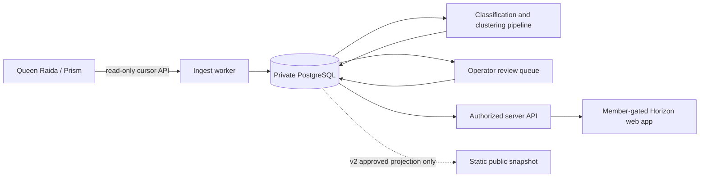
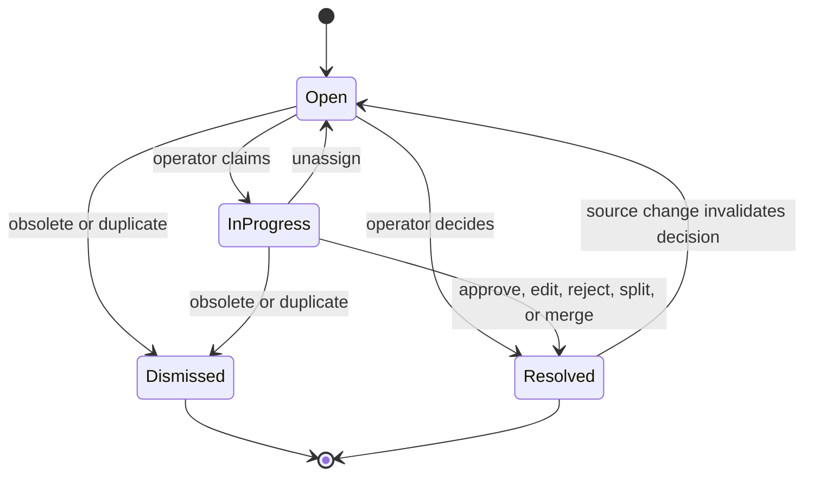

# Horizon Technical Specification

Status: Draft for implementation

Product: Horizon

Audience: RaidGuild product, BD, engineering, and security operators

Companion document: [PRD.md](PRD.md)

Where this specification and the PRD differ on release sequencing or technical
implementation, this specification controls v1. The PRD remains the product
vision, including the eventual public surface.

## 1. Purpose

This document turns the Horizon PRD into a build-ready system design. It defines
the v1 architecture, data contracts, clustering behavior, review workflow,
security boundary, application components, APIs, test strategy, and delivery
sequence.

Horizon v1 is a private, member-gated BD operating surface. It ingests source
records from Queen Raida/Prism, conservatively groups them into opportunity
threads, synthesizes source-backed status, and presents the result to authorized
RaidGuild members. A sanitized public projection is a v2 capability and is not
part of the v1 release gate.

The primary technical risk is trust collapse caused by incorrect thread merges,
unsupported synthesis, or accidental disclosure. The system therefore prefers
under-clustering over over-merging, keeps unresolved records separate, requires
evidence for every material claim, and makes human corrections durable.

## 2. V1 Decisions

These choices are fixed for the first implementation unless discovery reveals a
hard constraint.

| Area | V1 decision |
| --- | --- |
| Audience | RaidGuild members and approved operators only |
| Authentication | Discord OAuth with RaidGuild server membership and role checks |
| Primary CTA | `Contact owner` |
| Source | Read-only Queen Raida/Prism adapter |
| Application | Next.js App Router with server-enforced authorization |
| Worker | TypeScript command-line worker running scheduled pipeline jobs |
| Private store | PostgreSQL |
| Contracts | Zod schemas shared by worker and web application |
| Data access | Drizzle ORM and explicit SQL migrations |
| Model access | Provider adapter with structured outputs and prompt versioning |
| Refresh cadence | Four times per day, configurable |
| Public output | Disabled in v1; approved public snapshot export added in v2 |
| Corrections | Human merge, split, stage, owner, and visibility overrides persist |

Exact package versions must be locked when the repository is scaffolded. Use the
current Node.js LTS release and the repository lockfile in development, CI, and
production.

## 3. Scope

### 3.1 Included in v1

- Read-only seed and incremental ingest from Queen Raida/Prism.
- Private normalized storage for source records.
- BD relevance, entity, stage, action, and sensitivity classification.
- Conservative opportunity-thread clustering.
- Thread synthesis with evidence and independent confidence scores.
- Member-gated overview, board, thread detail, review queue, and ops health.
- Manual merge, split, stage, owner, archive, and disclosure corrections.
- One member action: contact the assigned thread owner.
- Scheduled refresh, audit events, and pipeline telemetry.
- Fixture-based local development when Queen Raida is unavailable.

### 3.2 Deferred to v2

- Anonymous public access.
- Static `public/data/horizon.json` publication.
- Public CTA forms and lead capture.
- CRM writeback.
- Automated member matching.
- Graph visualization or Quartz archive.
- Generated images or video.

## 4. System Context



Raw messages, transcripts, CRM notes, model prompts containing source text, and
private evidence never cross the authorized server boundary. The browser
receives a member projection containing synthesized fields and approved evidence
labels, not raw source bodies.

## 5. Repository Layout

The implementation should use a pnpm workspace with these ownership boundaries:

```text
apps/
  web/                       Next.js application and authorized route handlers
  worker/                    Scheduled ingest and synthesis commands
packages/
  contracts/                 Zod schemas, enums, and API types
  db/                        Drizzle schema, migrations, and repositories
  queen-raida-adapter/       Source adapter and contract fixtures
  pipeline/                  Classify, resolve, cluster, synthesize, sanitize
  policy/                    Disclosure rules and sanitizer policy
  observability/             Structured logs, metrics, and job tracing
fixtures/
  queen-raida/               Synthetic source records; no production data
  evaluations/               Reviewed clustering and sanitizer cases
prompts/
  classify/                  Versioned classification prompts
  compare/                   Versioned pairwise comparison prompts
  synthesize/                Versioned synthesis prompts
  sanitize/                  Versioned disclosure prompts
scripts/
  seed-fixtures.ts
  evaluate.ts
  export-public-snapshot.ts  Disabled until v2
```

## 6. Component Map

| Component | Responsibility | Reads | Writes |
| --- | --- | --- | --- |
| Queen Raida adapter | Page through changed source records using a cursor | Queen Raida/Prism | Normalized adapter records |
| Ingest worker | Validate, hash, deduplicate, tombstone, and persist records | Adapter records | `source_atoms`, `sync_cursors` |
| Classifier | Extract BD relevance, entities, stage/action signals, and risk | Unclassified atoms | `atom_classifications` |
| Entity resolver | Normalize aliases without asserting uncertain identity | Classifications, overrides | `entities`, `entity_mentions` |
| Candidate generator | Produce plausible thread memberships with bounded search | Atoms, entities, active threads | Candidate pairs |
| Cluster engine | Apply hard keys, vetoes, scores, thresholds, and overrides | Candidate pairs | `thread_memberships`, review items |
| Synthesizer | Build current thread state from accepted evidence | Thread atoms and overrides | `thread_versions`, transitions |
| Policy engine | Classify disclosure and redact or block fields | Synthesized versions | disclosure findings, review items |
| Review service | Apply operator decisions and durable corrections | Review mutations | overrides, audit events, new job requests |
| Snapshot builder | Produce an immutable member projection | Approved internal thread versions | `snapshots` |
| Authorized API | Serve member-safe projections and accept operator actions | Snapshots, reviews | Review mutations |
| Web app | Render overview, board, details, reviews, and ops | Authorized API | Operator actions |
| Job orchestrator | Run scheduled stages idempotently and report health | Schedule/manual trigger | `pipeline_runs`, logs, metrics |

## 7. Queen Raida Source Contract

The exact Queen Raida/Prism transport is an implementation discovery item. The
rest of Horizon must depend on this adapter contract, not on database-specific
tables or API response shapes.

```ts
export interface QueenRaidaSourceAdapter {
  getCapabilities(): Promise<SourceCapabilities>;
  listRecords(input: ListRecordsInput): Promise<ListRecordsPage>;
  getRecord(id: string): Promise<SourceRecord | null>;
  healthcheck(): Promise<SourceHealth>;
}

export interface ListRecordsInput {
  cursor?: string;
  updatedAfter?: string;
  limit: number;
}

export interface ListRecordsPage {
  records: SourceRecord[];
  nextCursor?: string;
  hasMore: boolean;
  watermark: string;
}
```

Required source record:

```ts
export interface SourceRecord {
  source: "queen_raida" | "prism";
  sourceType:
    | "discord_message"
    | "discord_thread"
    | "meeting_transcript"
    | "meeting_summary"
    | "crm_note"
    | "crm_opportunity"
    | "proposal"
    | "other";
  sourceId: string;
  sourceRevision?: string;
  occurredAt: string;
  updatedAt: string;
  deletedAt?: string;
  author?: SourceActor;
  container?: SourceContainer;
  body: string;
  internalUrl?: string;
  visibilityHint?: "internal" | "restricted" | "public";
  relations: {
    replyToId?: string;
    discordThreadId?: string;
    meetingId?: string;
    crmOpportunityId?: string;
    proposalId?: string;
  };
  metadata: Record<string, unknown>;
}
```

Adapter requirements:

- Read-only credentials with the smallest available scope.
- Stable IDs and an incremental cursor or updated-time watermark.
- Idempotent replay of any page.
- Tombstones for deleted or revoked records where supported.
- Exponential backoff with jitter for transient failures.
- Contract tests against synthetic fixtures and a staging response sample.
- No source body content in logs, metrics, errors, or tracing attributes.

If the source cannot provide reliable deletion events, run a weekly bounded
reconciliation of records in the active 180-day window.

## 8. Core Data Model

All IDs are UUIDv7 unless an external source ID is explicitly named. All times
are UTC. JSON columns are validated at write boundaries with shared schemas.

### 8.1 Enums

```ts
export const BdStage = z.enum([
  "new_signal",
  "warm_intro",
  "discovery",
  "scoping",
  "proposal",
  "approved_funded",
  "active_delivery",
  "dormant",
  "closed",
]);

export const Momentum = z.enum([
  "emerging",
  "active",
  "blocked",
  "stale",
  "closing",
]);

export const ThreadState = z.enum([
  "candidate",
  "needs_review",
  "approved_internal",
  "archived",
  "rejected",
]);

export const DisclosureState = z.enum([
  "internal_only",
  "public_candidate",
  "public_approved",
  "blocked",
]);

export const ReviewKind = z.enum([
  "cluster_merge",
  "cluster_split",
  "stage_change",
  "owner_assignment",
  "synthesis_claim",
  "disclosure",
]);

export const ReviewStatus = z.enum([
  "open",
  "in_progress",
  "resolved",
  "dismissed",
]);
```

### 8.2 PostgreSQL tables

#### `source_atoms`

Immutable normalized source revisions. A changed source record creates a new
revision; it does not overwrite history.

| Column | Type | Notes |
| --- | --- | --- |
| `id` | uuid PK | Internal atom ID |
| `source_system` | text | `queen_raida` or `prism` |
| `source_type` | text | Validated source kind |
| `source_id` | text | Stable external ID |
| `source_revision` | text nullable | External revision when available |
| `content_hash` | text | SHA-256 of canonical source record |
| `occurred_at` | timestamptz | Source event time |
| `updated_at` | timestamptz | Source update time |
| `ingested_at` | timestamptz | Horizon ingest time |
| `deleted_at` | timestamptz nullable | Source tombstone |
| `author_json` | jsonb nullable | Private source actor |
| `container_json` | jsonb nullable | Private source location |
| `body_ciphertext` | bytea | Application-encrypted raw body |
| `relations_json` | jsonb | Stable source relations |
| `metadata_json` | jsonb | Allowlisted metadata only |

Constraints and indexes:

- Unique on `(source_system, source_id, content_hash)`.
- Index on `(source_system, updated_at)` for reconciliation.
- Index relation IDs extracted into generated columns where query volume
  justifies it.
- Deleted atoms remain for audit but are excluded from active synthesis.

#### `atom_classifications`

One versioned classification per atom and classifier version.

| Column | Type | Notes |
| --- | --- | --- |
| `id` | uuid PK | Classification ID |
| `atom_id` | uuid FK | Source atom |
| `classifier_version` | text | Prompt plus code version |
| `model_provider` | text | Provider identifier |
| `model_name` | text | Exact model identifier |
| `bd_relevance` | numeric | 0 to 1 |
| `service_lines` | text[] | Controlled taxonomy |
| `stage_signals_json` | jsonb | Stage, confidence, evidence span |
| `action_signals_json` | jsonb | Action, owner hint, due date hint |
| `entities_json` | jsonb | Mention candidates, not asserted truth |
| `risk_labels` | text[] | Sensitivity categories |
| `confidence` | numeric | Overall extraction confidence |
| `created_at` | timestamptz | Classification time |

#### `entities` and `entity_mentions`

`entities` stores canonical people, organizations, projects, proposals, and
service lines. `entity_mentions` connects extracted text spans to an entity with
a confidence score and resolution method. An unresolved mention remains a
mention; it must not be forced onto a canonical entity.

#### `threads`

Stable opportunity identity independent of generated summaries.

| Column | Type | Notes |
| --- | --- | --- |
| `id` | uuid PK | Stable Horizon thread ID |
| `state` | text | `ThreadState` |
| `canonical_key` | text nullable | Deterministic CRM/proposal key |
| `created_at` | timestamptz | First creation |
| `updated_at` | timestamptz | Last material update |
| `archived_at` | timestamptz nullable | Archive time |
| `superseded_by_id` | uuid nullable | Set after manual merge |

#### `thread_memberships`

| Column | Type | Notes |
| --- | --- | --- |
| `thread_id` | uuid FK | Thread |
| `atom_id` | uuid FK | Source atom |
| `method` | text | `hard_key`, `scored`, `manual`, `seed` |
| `score` | numeric | Membership confidence |
| `decision_json` | jsonb | Feature scores and veto results |
| `active` | boolean | False after split/reassignment |
| `created_at` | timestamptz | Decision time |
| `created_by` | text | Pipeline version or operator ID |

Only one active membership is allowed per atom unless the atom is explicitly
marked `multi_thread_evidence` by an operator.

#### `thread_versions`

Immutable synthesized state. The latest approved version is the default member
projection.

```ts
export const ThreadVersionSchema = z.object({
  id: z.string().uuid(),
  threadId: z.string().uuid(),
  version: z.number().int().positive(),
  title: z.string().min(1).max(120),
  summary: z.string().min(1).max(1200),
  whyItMatters: z.string().max(800).nullable(),
  stage: BdStage,
  momentum: Momentum,
  owner: z.object({
    entityId: z.string().uuid(),
    displayName: z.string(),
    contactRoute: z.string(),
  }).nullable(),
  organizations: z.array(z.string().uuid()),
  serviceLines: z.array(z.string()),
  neededCapabilities: z.array(z.string()),
  nextAction: z.string().max(500).nullable(),
  nextActionDueAt: z.string().datetime().nullable(),
  openQuestions: z.array(z.string().max(300)).max(10),
  lastActivityAt: z.string().datetime(),
  clusteringConfidence: z.number().min(0).max(1),
  synthesisConfidence: z.number().min(0).max(1),
  stageConfidence: z.number().min(0).max(1),
  disclosureState: DisclosureState,
  evidenceIds: z.array(z.string().uuid()).min(1),
  promptVersion: z.string(),
  modelProvider: z.string(),
  modelName: z.string(),
});
```

#### `evidence_claims`

Every material synthesized statement must resolve to one or more evidence
claims.

```ts
export const EvidenceClaimSchema = z.object({
  id: z.string().uuid(),
  threadVersionId: z.string().uuid(),
  claimPath: z.string(),
  claimText: z.string(),
  atomIds: z.array(z.string().uuid()).min(1),
  support: z.enum(["direct", "inferred", "operator_asserted"]),
  confidence: z.number().min(0).max(1),
  memberLabel: z.string().max(160),
  sourceUrlAvailable: z.boolean(),
});
```

The member projection may include `memberLabel` and an authorized deep link. It
must never include raw evidence text.

#### `stage_transitions`

Stores proposed and accepted stage changes with `from_stage`, `to_stage`,
`effective_at`, evidence IDs, confidence, decision source, and optional reviewer.
Stage history is derived from accepted transitions rather than synthesized from
scratch on every run.

#### `review_items`

```ts
export const ReviewItemSchema = z.object({
  id: z.string().uuid(),
  kind: ReviewKind,
  status: ReviewStatus,
  priority: z.enum(["critical", "high", "normal", "low"]),
  threadIds: z.array(z.string().uuid()).max(5),
  atomIds: z.array(z.string().uuid()).max(100),
  reasonCodes: z.array(z.string()),
  proposedChange: z.record(z.string(), z.unknown()),
  assignedTo: z.string().uuid().nullable(),
  createdAt: z.string().datetime(),
  resolvedAt: z.string().datetime().nullable(),
  resolution: z.record(z.string(), z.unknown()).nullable(),
});
```

#### `operator_overrides`

Durable instructions applied before automated decisions. Supported kinds:

- `force_merge`
- `never_merge`
- `force_membership`
- `exclude_atom`
- `set_stage`
- `set_owner`
- `set_title`
- `set_visibility`
- `archive_thread`

Overrides store scope, value, author, reason, creation time, and optional expiry.
They are never silently replaced by a later model run.

#### Operational tables

- `sync_cursors`: source cursor, watermark, and last successful sync.
- `pipeline_runs`: stage timing, status, counts, code version, and error class.
- `snapshots`: immutable member projection, schema version, checksum, and time.
- `audit_events`: append-only operator and system mutations.

## 9. Clustering Specification

Clustering is the highest-risk subsystem. Its objective is not to minimize the
number of threads. Its objective is to create identities that operators trust.

### 9.1 Invariants

1. Prefer under-clustering over over-merging.
2. An unresolved item remains separate until confidence clears a threshold or an
   operator resolves it.
3. Never auto-merge two established threads solely on semantic similarity.
4. Explicit different CRM opportunity IDs are a hard `never_merge` veto.
5. Manual `never_merge`, split, and membership decisions override all model
   output.
6. Every scored decision stores its component features and pipeline version.
7. Clustering confidence is independent from summary and stage confidence.
8. A low-confidence membership cannot silently affect an approved thread.

### 9.2 Decision order

For each new relevant atom:

1. Apply active operator overrides.
2. Match deterministic keys.
3. Generate a bounded candidate set.
4. Apply hard contradiction vetoes.
5. Score remaining candidates.
6. Auto-attach, request review, or create a separate candidate thread.
7. Synthesize only from accepted memberships.

### 9.3 Deterministic keys

Auto-attach with score `1.0` when a source record shares one of these stable
keys with exactly one active thread:

- CRM opportunity ID.
- Proposal or RIP ID.
- Explicit Queen Raida thread/opportunity ID.
- Discord thread ID, unless manually split.

A meeting ID or reply relationship is strong evidence but not a universal hard
key because one meeting or channel thread may discuss multiple opportunities.

### 9.4 Candidate generation

Compare an atom only to active threads that share at least one blocking feature:

- Resolved organization.
- Resolved external stakeholder.
- Explicit project, proposal, or opportunity alias.
- Discord thread or meeting container.
- Service-line overlap plus activity within 45 days.
- Embedding similarity above the retrieval floor.

Return at most 20 candidate threads. Candidate retrieval must not itself cause a
merge.

### 9.5 Hard vetoes

Reject automatic membership when any condition is true:

- Different explicit CRM opportunity IDs.
- Active `never_merge` override.
- Explicitly different named client organizations with no parent/alias relation.
- Source states that the item is unrelated to the candidate opportunity.
- Candidate is closed and the new atom describes a distinct new engagement.
- The only positive feature is semantic or service-line similarity.

### 9.6 Scoring

The scorer returns a feature breakdown, not only a model judgment.

| Feature | Weight |
| --- | ---: |
| Same stable source relation | 0.35 |
| Same resolved organization | 0.20 |
| Same resolved stakeholder | 0.10 |
| Same explicit project/proposal alias | 0.15 |
| Semantic similarity | 0.10 |
| Temporal proximity | 0.05 |
| Compatible service line and stage | 0.05 |

Rules:

- A hard veto forces the score to `0`.
- Missing data contributes `0`; it is not treated as agreement.
- Auto-attach threshold: `>= 0.88`.
- Review band: `0.70` through `0.8799`.
- Below `0.70`: create or retain a separate candidate thread.
- Two established threads may auto-merge only when they gain the same unique
  deterministic key. All other thread-to-thread merges require review.

Thresholds live in configuration and may change only after an evaluated fixture
set shows that auto-merge precision remains above the release threshold.

### 9.7 Cluster review payload

A merge review must show:

- Proposed source and destination threads.
- Matching and conflicting features.
- Confidence and threshold.
- Titles, organizations, owners, stages, and recent evidence labels.
- Consequence count: memberships and thread versions affected.
- Actions: `Confirm merge`, `Keep separate`, `Move selected items`, `Defer`.

`Keep separate` creates a durable `never_merge` override. `Move selected items`
creates explicit memberships and exclusions. A split creates a new stable thread
and replays synthesis for both resulting threads.

## 10. Classification and Synthesis

### 10.1 Classification

Only atoms with `bd_relevance >= 0.55` enter candidate generation. Atoms between
`0.40` and `0.5499` remain searchable for operators but do not create or alter
threads. Lower-scoring atoms are retained privately and excluded from Horizon
processing.

The classifier produces:

- BD relevance and reason codes.
- Entity mentions and resolution hints.
- Service-line candidates.
- Stage signals with supporting source spans.
- Next-action and owner hints.
- Sensitivity labels.
- Extraction confidence.

Source spans are stored privately for audit and are never sent to the browser.

### 10.2 Synthesis rules

- Use only active, accepted memberships.
- Recency-weight evidence but retain older facts still explicitly in force.
- Prefer direct CRM state over inferred conversational stage.
- Prefer an operator override over all source and model signals.
- Use `unknown` or `null` instead of inventing an owner, date, organization, or
  outcome.
- Mark inference as inference in the evidence claim.
- Do not describe interest, intent, funding, approval, or delivery as confirmed
  without direct evidence.
- Do not regress an accepted stage automatically unless direct evidence supports
  dormancy, loss, cancellation, or correction.
- Generate a new immutable version only when a material field changes.

### 10.3 Confidence gates

An internal thread version automatically becomes `approved_internal` only when:

- Clustering confidence is at least `0.88`.
- Synthesis confidence is at least `0.80`.
- Stage confidence is at least `0.80`, or the stage is `new_signal`.
- At least one evidence claim supports every material field.
- No critical or high disclosure finding is open.
- An owner exists, or the UI clearly displays `Owner needed`.

Otherwise it enters `needs_review`. Existing approved versions remain visible
with a `Review pending` marker until a replacement is approved.

## 11. Disclosure Policy and Sanitizer

V1 is member-gated, but it still applies a disclosure policy because guild
membership does not imply unrestricted access to every CRM or client detail.
The v2 public policy is stricter and requires explicit approval.

### 11.1 Policy result

```ts
export const DisclosureFindingSchema = z.object({
  fieldPath: z.string(),
  action: z.enum(["allow", "redact", "block", "review"]),
  category: z.enum([
    "secret",
    "private_endpoint",
    "personal_data",
    "client_confidential",
    "financial",
    "legal_security",
    "governance",
    "unsupported_claim",
    "raw_source",
  ]),
  reasonCode: z.string(),
  replacement: z.string().nullable(),
  confidence: z.number().min(0).max(1),
});
```

Deterministic detection runs before model-assisted policy classification. A
model can escalate a finding but cannot downgrade a deterministic `block`.

### 11.2 Policy examples

| Input or claim | Member v1 | Public v2 | Reason |
| --- | --- | --- | --- |
| `A protocol team is exploring monitoring support` with approved attribution | Allow | Allow | General opportunity state |
| `Discovery call completed; scope is being clarified` | Allow | Allow after client-name approval | Source-backed stage summary |
| `Contact the assigned Horizon owner` | Allow | Allow through approved route | Single supported CTA |
| Named contributor with an approved guild profile | Allow | Allow | Approved professional identity |
| Private Discord channel URL | Allow only for authorized role | Redact | Internal endpoint |
| Personal email or phone number | Redact in shared view | Redact | Personal data |
| Exact budget, rate, runway, or payment terms | Restricted role or redact | Block unless explicitly approved | Financial confidentiality |
| Unannounced prospect or client name | Restricted role or redact | Block pending approval | Client confidentiality |
| Raw Discord quote or transcript excerpt | Block | Block | Raw source disclosure |
| API key, token, password, seed phrase, private key | Block and alert | Block and alert | Secret |
| Legal dispute, security incident, allegation, or personnel issue | Block and require review | Block | High-risk sensitive content |
| `The deal is funded` based only on optimistic chat | Block as unsupported | Block as unsupported | Unsupported material claim |
| Internal governance strategy or vote coordination | Restricted and review | Block pending governance approval | Governance sensitivity |

### 11.3 Fail-closed behavior

- Schema validation failure: do not publish the new version.
- Sanitizer unavailable: do not approve or snapshot changed threads.
- Critical finding: hide the affected version and alert operators.
- Unknown policy category: route to review.
- Public v2 export: include only `public_approved` versions; absence of approval
  means exclusion.

## 12. Review Workflow

Review state belongs to a proposed decision, not to the entire source corpus.
This keeps operator work focused and allows approved thread versions to remain
useful while a later change is under review.



### 12.1 Automatic review creation

Create a review item when:

- Membership is in the clustering review band.
- A merge between established threads is proposed.
- Stage changes by two or more steps without a deterministic CRM signal.
- An approved thread loses its owner.
- A material claim has confidence below `0.80`.
- Any sanitizer result is `review` or `block`.
- A source deletion invalidates accepted evidence.
- A thread has conflicting direct stage or funding signals.

### 12.2 Roles

| Role | Permissions |
| --- | --- |
| Member | Read approved internal threads; contact owner |
| BD operator | Member permissions; review clusters, stages, owners, and summaries |
| Disclosure reviewer | Approve public candidates and resolve sensitive findings |
| Maintainer | Manage jobs, adapters, taxonomies, and operator access |
| Admin | Manage roles and emergency access; all actions audited |

One person may hold multiple roles. Public approval in v2 must be performed by a
disclosure reviewer and cannot be inferred from internal approval.

### 12.3 Review decisions

Every decision records operator ID, timestamp, reason, before/after payload,
source evidence IDs, and resulting override IDs. Editing generated text creates
an `operator_asserted` evidence claim and a durable field override; it does not
rewrite model history.

## 13. Member Projection and API

### 13.1 Member thread payload

```ts
export const MemberThreadSchema = z.object({
  id: z.string().uuid(),
  version: z.number().int(),
  title: z.string(),
  summary: z.string(),
  whyItMatters: z.string().nullable(),
  stage: BdStage,
  momentum: Momentum,
  freshness: z.enum(["today", "this_week", "this_month", "stale"]),
  lastActivityAt: z.string().datetime(),
  owner: z.object({
    displayName: z.string(),
    contactRoute: z.string(),
  }).nullable(),
  organizations: z.array(z.string()),
  serviceLines: z.array(z.string()),
  neededCapabilities: z.array(z.string()),
  nextAction: z.string().nullable(),
  nextActionDueAt: z.string().datetime().nullable(),
  openQuestions: z.array(z.string()),
  confidence: z.object({
    clustering: z.number(),
    synthesis: z.number(),
    stage: z.number(),
  }),
  evidence: z.array(z.object({
    id: z.string().uuid(),
    label: z.string(),
    occurredAt: z.string().datetime(),
    authorizedSourceUrl: z.string().nullable(),
  })),
  reviewPending: z.boolean(),
});
```

### 13.2 Server routes

All v1 routes require an authenticated session. Mutation routes also require a
role and CSRF protection.

| Method | Route | Purpose |
| --- | --- | --- |
| `GET` | `/api/v1/overview` | Counts, recent changes, stale and action-needed threads |
| `GET` | `/api/v1/threads` | Filtered, sorted, cursor-paginated thread list |
| `GET` | `/api/v1/threads/:id` | Thread detail and stage history |
| `GET` | `/api/v1/reviews` | Operator review queue |
| `POST` | `/api/v1/reviews/:id/claim` | Claim a review item |
| `POST` | `/api/v1/reviews/:id/resolve` | Apply a review decision |
| `GET` | `/api/v1/ops` | Pipeline and source health |
| `POST` | `/api/v1/jobs/sync` | Maintainer-triggered idempotent sync |

The contact action is rendered from the approved owner's `contactRoute`. It is
not an open-ended form in v1. Valid routes are allowlisted Discord deep links or
RaidGuild-controlled email aliases. Personal contact details do not appear in
the projection.

### 13.3 Sorting

Default board order is deterministic:

1. Explicit action due or overdue.
2. Stage advanced in the last seven days.
3. Activity recency.
4. Momentum: active, emerging, blocked, stale, closing.
5. Stable thread ID as final tie-breaker.

Confidence is shown as a trust signal but is not used to promote a questionable
thread above a confirmed one.

## 14. Web Application Component Map

```text
AppShell
|-- AuthBoundary
|-- PrimaryNav
|-- SyncHealthIndicator
`-- RouteContent
    |-- OverviewPage
    |   |-- MetricStrip
    |   |-- NeedsActionList
    |   `-- RecentChanges
    |-- ThreadBoardPage
    |   |-- ThreadFilters
    |   |-- ThreadSort
    |   `-- ThreadTable / ThreadCardList
    |-- ThreadDetailPage
    |   |-- ThreadHeader
    |   |-- StatusSummary
    |   |-- StageTimeline
    |   |-- EvidenceList
    |   |-- OpenQuestions
    |   `-- ContactOwnerAction
    |-- ReviewQueuePage (operator)
    |   |-- ReviewFilters
    |   |-- ClusterComparison
    |   |-- DisclosureFindings
    |   `-- DecisionBar
    `-- OpsPage (maintainer)
        |-- PipelineRunTable
        |-- SourceCoverage
        |-- FailureSummary
        `-- ModelAndPromptVersions
```

The first screen is the operating surface, not a marketing landing page.
Desktop should favor a dense table/list suitable for scanning. Mobile may use a
card list. Components must handle loading, empty, stale, partial failure,
low-confidence, review-pending, and unauthorized states.

## 15. Authentication and Authorization

1. Authenticate with Discord OAuth.
2. On sign-in and periodically thereafter, verify membership in the configured
   RaidGuild Discord server.
3. Map allowlisted Discord roles to Horizon roles.
4. Store only the minimum Discord identity and authorization metadata required.
5. Revoke sessions when guild membership or required roles are lost.
6. Enforce authorization in server code and database queries; hidden controls in
   the UI are not an authorization boundary.

Authentication configuration and secrets remain server-side. The application
must have a documented emergency method to disable all access without changing
source data.

## 16. Pipeline Execution

Each scheduled run uses a unique `run_id` and executes idempotent stages:

```text
healthcheck source
  -> ingest changed records
  -> classify new revisions
  -> resolve entity mentions
  -> apply overrides
  -> generate cluster candidates
  -> decide memberships / create reviews
  -> synthesize changed accepted threads
  -> evaluate disclosure policy
  -> approve eligible internal versions
  -> build member snapshot
  -> record metrics and alert on failure
```

Job rules:

- Only one ingest run per source may hold the advisory lock.
- A failed stage may be retried without duplicating records or reviews.
- Snapshot activation is atomic: members see the previous complete snapshot or
  the next complete snapshot, never a partial result.
- A critical sanitizer or schema failure prevents activation but does not remove
  the previous healthy snapshot.
- Reprocessing can be scoped by atom, thread, source window, prompt version, or
  full corpus.

## 17. Observability

### 17.1 Required metrics

- Source records fetched, created, changed, tombstoned, and rejected.
- Classification success, schema failure, latency, and cost.
- Candidate pairs generated and vetoed.
- Auto-attaches, review-band decisions, separate-thread decisions, manual merges,
  and manual splits.
- Synthesis success, no-op versions, and review-gated versions.
- Disclosure findings by action and category.
- Snapshot age and active thread count.
- Review queue age by kind and priority.
- End-to-end job duration and last successful completion.

### 17.2 Alerts

Alert maintainers when:

- No successful sync occurs within twice the configured interval.
- Source count drops by more than 50% relative to the recent baseline.
- Schema failures exceed 2% of a run.
- Any critical disclosure finding is generated.
- Snapshot activation fails twice consecutively.
- Auto-merge precision in reviewed samples falls below target.

Logs use structured event names, IDs, counts, durations, and error classes. They
must not contain source bodies, generated private summaries, contact details, or
credentials.

## 18. Security and Privacy Controls

- Treat all source text as untrusted content, never as instructions.
- Delimit source content in prompts and explicitly forbid tool use or instruction
  following from that content.
- Validate every model response against a strict schema and size limits.
- Encrypt raw source bodies at the application layer and storage layer.
- Use separate source, application, migration, and read-only operations roles.
- Keep production data out of fixtures, CI artifacts, analytics, and error tools.
- Redact source bodies before any model request logging.
- Restrict evidence deep links according to source role permissions.
- Record all review decisions and privileged access changes in append-only audit
  events.
- Back up encrypted private data and test restore procedures.
- Define retention by source class during Milestone 0; deletion must propagate to
  future snapshots and invalidate unsupported claims.

Before any public v2 release, perform a threat model and disclosure review using
realistic adversarial fixtures, including prompt injection, secrets, personal
data, unsupported funding claims, and hidden client identity.

## 19. Testing and Evaluation

### 19.1 Automated tests

| Layer | Required coverage |
| --- | --- |
| Contracts | Valid/invalid adapter, model, database, API, and snapshot payloads |
| Adapter | Pagination, cursor resume, duplicate replay, deletion, rate limit, malformed records |
| Pipeline units | Feature weights, vetoes, thresholds, overrides, stage transitions, redaction |
| Database | Constraints, idempotency, immutable versions, transactional snapshot activation |
| Integration | Fixture ingest through member projection without external services |
| Authorization | Every route and field against member/operator/maintainer roles |
| E2E | Sign-in, filter, detail, contact owner, review merge/split, stale-data state |
| Security | Prompt injection fixtures, secret detection, raw-body leakage checks |

### 19.2 Golden evaluation set

Before pilot launch, BD operators must label at least:

- 100 source atoms for BD relevance and stage signals.
- 75 atom-to-thread membership decisions.
- 25 deliberately confusing near-duplicate opportunity pairs.
- 25 thread summaries for factual support and usefulness.
- 50 disclosure examples across allow, redact, review, and block.

The evaluation set contains synthetic or appropriately controlled data and is
versioned separately from production raw records.

### 19.3 V1 release thresholds

- Auto-merge precision: at least 97%.
- Incorrect merge rate: no more than 2% in the reviewed sample.
- Stage acceptance without edit: at least 85%.
- Material summary claim support: 100% of sampled claims have evidence.
- Secret detection recall: 100% on the security fixture set.
- Block/redact recall: at least 98% on labeled high-risk fixtures.
- No raw source body present in browser responses, logs, or build artifacts.
- Median authorized page load under 2.5 seconds on the target deployment.

Recall for thread grouping is intentionally secondary to merge precision in v1.
Operators can combine separate threads; recovering trust after a false merge is
more expensive.

## 20. Success Measurement

Horizon succeeds when it changes operator behavior, not merely when it produces
plausible threads.

Establish a two-week baseline before the pilot, then measure for four weeks:

| Metric | Definition | V1 target |
| --- | --- | --- |
| Time to useful awareness | Median time for a member to identify active work, owner, and next action | Under 3 minutes |
| Context scavenging | Self-reported weekly time BD operators spend searching Discord/meetings for current state | 30% reduction |
| Horizon-assisted advances | Opportunities that moved stage or gained a concrete next action after being surfaced in Horizon | Track weekly; 5+ during pilot |
| Owner contact completion | Eligible `Contact owner` actions that lead to an acknowledged conversation | Establish baseline, then improve |
| Weekly active operators | Authorized BD operators who use Horizon in a week | At least 70% of pilot group |
| Correction burden | Manual cluster corrections per 20 active threads | Declining over four pilot weeks |

An operator marks an opportunity `Horizon-assisted` with a reason code; the
system does not infer causation from a page view or click.

## 21. Delivery Plan

### Milestone 0: Contract and policy discovery

- Confirm Queen Raida/Prism transport, fields, permissions, cursor, and deletion
  behavior.
- Obtain a sanitized staging sample and implement adapter contract tests.
- Confirm Discord guild and role mapping.
- Name the BD review owner and disclosure reviewer.
- Approve retention, visibility, and incident handling policy.
- Capture baseline operator behavior metrics.

Exit: source contract, access model, policy owner, and synthetic fixtures are
approved.

### Milestone 1: Foundation and ingest

- Scaffold workspace, contracts, database, migrations, worker, and web app.
- Implement source adapter, encryption, cursors, idempotency, and tombstones.
- Add pipeline run tracking and fixture seed command.

Exit: a seed and incremental fixture ingest produce private normalized atoms
without leaking source text.

### Milestone 2: Classification and conservative clustering

- Implement structured classification and entity mentions.
- Implement hard keys, candidate blocking, vetoes, scoring, and thresholds.
- Implement durable overrides and merge/split operations.
- Build the first golden clustering evaluation.

Exit: auto-merge precision reaches 97% on the reviewed fixture set.

### Milestone 3: Synthesis, policy, and review

- Implement immutable thread versions and evidence claims.
- Implement stage transitions and confidence gates.
- Implement sanitizer rules, disclosure findings, and review queue.
- Add operator review screens for merge, split, stage, owner, and content.

Exit: every material claim has evidence and all high-risk fixtures fail closed.

### Milestone 4: Member pilot

- Implement Discord authentication, role mapping, overview, board, detail, and
  contact-owner action.
- Add ops health, scheduled jobs, alerts, and atomic member snapshots.
- Pilot with a small BD operator group using real controlled data.

Exit: security checks pass, pilot operators approve output quality, and behavior
metrics are being captured.

### Milestone 5: V1 release

- Resolve pilot trust issues and tune thresholds against reviewed evidence.
- Document operations, incident response, restore, and access revocation.
- Expand access to authorized RaidGuild members.

Exit: all v1 release thresholds pass for two consecutive refresh cycles and the
named product owner signs off.

## 22. Public V2 Gate

Public publishing must not be enabled merely because the member pilot works. It
requires all of the following:

- Separate `public_approved` disclosure state and reviewer role.
- Explicit policy for client names, contributor identities, funding, and
  governance claims.
- Public projection schema containing no internal URLs or confidence/debug data.
- Static artifact leak test in CI.
- Manual review of the first complete public snapshot.
- Rollback that restores the previous approved snapshot immediately.
- Incident owner and takedown procedure.

Only then may the worker produce `public/data/horizon.json` from approved public
fields. Raw atoms and the member projection must remain outside the public build
context.

## 23. Open Implementation Inputs

These inputs must be answered during Milestone 0; they do not block repository
scaffolding or fixture-based development:

1. Queen Raida/Prism API or database access contract.
2. Available deletion, visibility, relation, and CRM opportunity fields.
3. Discord guild ID and role-to-Horizon-role mapping.
4. Approved owner contact routes and fallback when no owner exists.
5. Named BD review owner and disclosure reviewer.
6. Retention periods by source type.
7. Hosting environment and managed PostgreSQL provider.
8. Model provider constraints, data-processing terms, and budget.

Until these are resolved, implementations must use synthetic fixtures, disabled
production connectors, and `internal_only` disclosure defaults.
